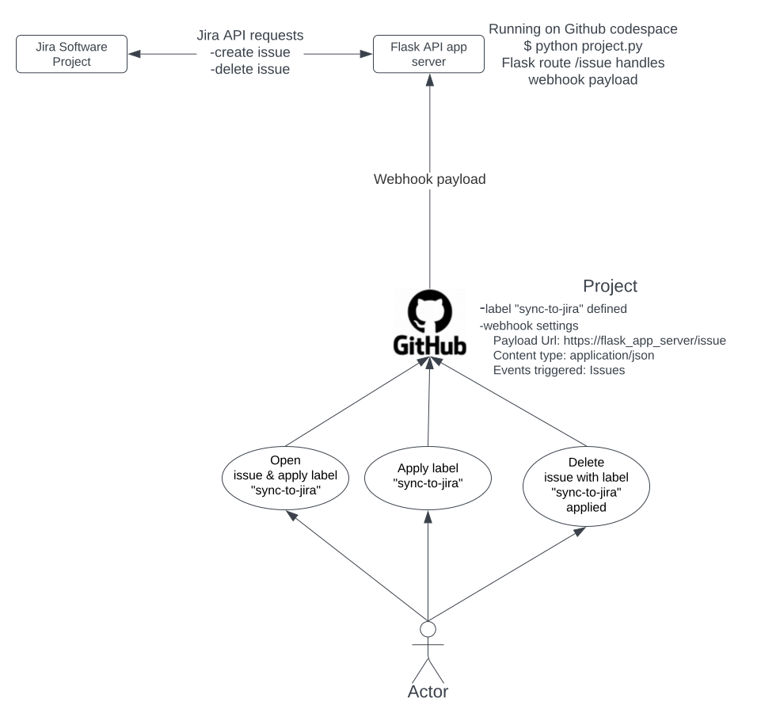
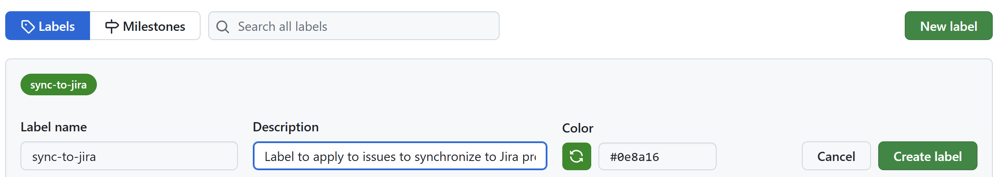
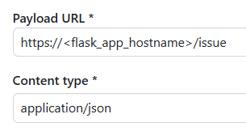
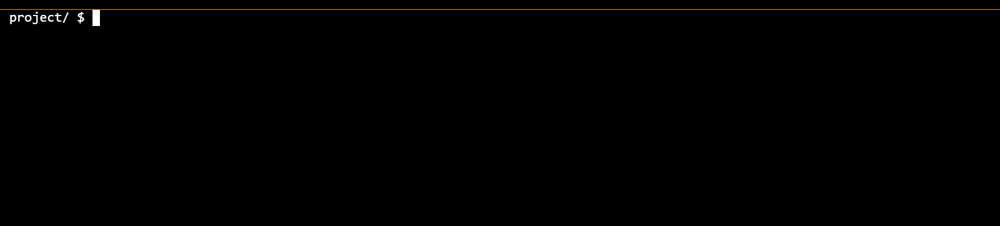
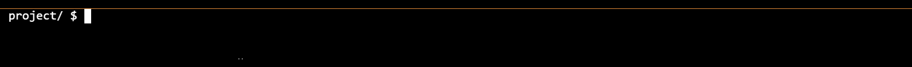
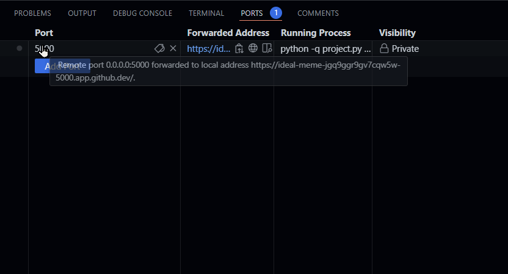

# GitHub-Jira IssueSync Plus

<div align="center">
  GitHub-Jira IssueSync Plus
</div> 
 
<div align="center">
<br />

[](https://img.shields.io/badge/Python%20version-%3E=3.12-red) [](https://img.shields.io/badge/Flask%20version-%3E=3.0-red) [](https://img.shields.io/badge/pytest-Passed-green) [](https://img.shields.io/badge/mypy-Passed-green) [](https://github.com/clementerr)

</div>

<details open="open">
<summary>Table of Contents</summary>

- [About](#about)
  - [Built With](#built-with)
- [What it Does](#what-it-does)
  - [Scenario](#scenario)
  - [Solution](#solution)
  - [Team Structure](#team-structure)
  - [Workflow](#workflow)
- [How it Works](#how-it-works)
  - [Functioning](#functioning)
  - [Class Diagram](#class-diagram)
  - [Classes Explanation](#classes-explanation)
- [Breakdown of project files](#breakdown-of-project-files)
- [Prerequisites](#prerequisites)
- [Installation](#installation)
- [Usage](#usage)
- [Author](#author)
- [Acknowledgements](#acknowledgements)
- [License](#license)

</details>

## About

A webhook-driven Flask API application for synchronizing GitHub Issues to a Jira Project.

### Built With

* Python v3.12 (https://docs.python.org/)
* Flask framework v3.0 (https://flask.palletsprojects.com/en/3.0.x/)
* Jira API v3 (https://developer.atlassian.com/cloud/jira/platform/rest/v3/intro/)
* Testing:
    * pytest v8.2 (https://docs.pytest.org/en/latest/)
    * mypy v1.10 (https://mypy.readthedocs.io/en/latest/)
* Additional Packages:
    * requests v2.32 (https://docs.python-requests.org/en/latest/)
    * python-dotenv v1.0 (https://github.com/theskumar/python-dotenv)
* Consulted Resources:
    * Dan Bader. "Python's Instance, Class, and Static Methods Demystified" [Real Python](https://realpython.com/instance-class-and-static-methods-demystified)
    * Corey Schafer. "Python OOP Tutorial 3: classmethods and staticmethods" [YouTube](https://youtu.be/rq8cL2XMM5M)
    * Beau. (2023). "All Python Syntax in 25 Minutes – Tutorial" [YouTube](https://youtu.be/PNSIWjWAA7o)
    *  anthonywritescode. (2023). "pytest: everything you need to know about fixtures." [YouTube](https://youtu.be/ScEQRKwUePI)
    * **Note:** The Jira API requests code and the data contained in jira_api_info.json in this project reference the official Jira API v3 documentation.

## What it Does

### Scenario

In organizations using both GitHub for issue tracking and Jira for project management, maintaining consistency between the two platforms can be time-consuming and error-prone.

### Solution

To streamline this process, the developed Flask API application automatically synchronizes GitHub issues with Jira based on specific criteria.

### Team Structure

 - QA Team: Responsible for creating GitHub issues to report bugs, feature requests, or other issues discovered during testing.
- Development Team: Focuses on implementing features and fixing bugs based on issues in Jira.
- Development Manager: Acts as a gatekeeper, reviewing GitHub issues and applying labels and categorizing them as bugs or features if they are appropriate for the next Jira sprint based on their impact, feasibility, and alignment with overall product goals.

### Workflow



1.  QA Team Creates GitHub Issues: When the QA team identifies a bug or potential feature, they create a new issue in GitHub.
2. Development Manager Triage: The development manager reviews the newly created GitHub issues and based on their assessment applies "sync-to-jira" label and categorizes issue writing a keyword:value pair in Issue description field e.g. "ghIssueType:Task" when issue type is not the default one "Bug".
3. GitHub Webhook Trigger: GitHub sends a webhook notification to the Flask API endpoint (/issue) when any issue is created or updated.
4. Flask API Trigger: The Flask API route /issue passes the webhook payload to the appropriate method.
5. Jira Issue Creation/Removal: The Flask API action method (open or delete) parses the webhook payload and creates or deletes the corresponding issue in Jira using Jira API requests.

## How it Works

### Functioning

**1. Setting Up and Listening:**

- A Flask application is developed to automate one-way issue synchronization from GitHub to Jira.
- This application runs continuously, waiting for incoming notifications from GitHub in the form of **webhooks**.
- Webhooks are real-time updates sent by GitHub whenever an issue is created, updated, or deleted.

**2. Processing Webhook Data:**

-   When a webhook arrives, the Flask route (/issue) receives a **JSON payload** containing details about the GitHub issue and calls the static method `JiraIssue.request_handler`  to process it.
-   The request_handler  method parses this data to understand the type of event (open, update, delete, label) and the specific issue information.
-   It then checks for a predefined label (e.g., "sync-to-jira") on the GitHub issue. This label acts as a trigger for syncing with Jira.

**JiraIssue.request_handler method**  

```python
@staticmethod
    def request_handler(issue_info: dict) -> requests.Response:
        """
        Handles the GitHub webhook request and interacts with Jira API.

        Args:
            issue_info (dict): The data from the GitHub webhook.

        Returns:
            requests.Response: The response from the Jira API or a default response if no action is taken.
        """

        sync_actions = ("labeled", "deleted")

        # Default response object to return if no action is performed
        response = requests.Response()
        response.status_code = 200
        response._content = b'{"action_performed": "No action"}'
        response.headers["Content-Type"] = "application/json"

        if issue_info["action"] in sync_actions:

            jira_api = JiraAPI()
            jira_project = JiraProject("jira", "CD", jira_api)
            jira_issue_id = JiraIssue.github_issue_exists(jira_api, jira_project.key, issue_info["issue"]["id"])

            if issue_info["action"] == "labeled" and issue_info["label"]["name"] == JiraIssue.GITHUB_SYNC_LABEL:

                if jira_issue_id == "0":
                    # Issue was opened in GitHub
                    jira_issue = JiraIssue("issue_dict", issue_info)
                    response = jira_issue.open(jira_api, jira_project)
                    # Add action performed to response.text
                    response_dict = json.loads(response.text)
                    response_dict["action_performed"] = "open"
                    response._content = json.dumps(response_dict).encode("utf-8")

            else:
                # action deleted does not contain any label
                if jira_issue_id != "0":
                    response = JiraIssue.delete(jira_api, jira_issue_id)
                    # Create response.text with action performed key because deleted API reponse returns empty .text
                    response._content = f'{{"action_performed": "delete", "id": "{jira_issue_id}"}}'.encode('utf-8')

        # Add GitHub issue id and action to response.text
        response_dict = json.loads(response.text)
        response_dict["github_issue_id"] = issue_info["issue"]["id"]
        response_dict["github_issue_action"] = issue_info["action"]
        response._content = json.dumps(response_dict).encode("utf-8")

        return response
```  

**3. Interacting with Jira:**

-   The application loads Jira API credentials from a `.env` file using python-dotenv module to connect securely with the Jira API.
-   Based on the received data and configured project details, the request handler method performs various actions:

    -   **Creating a New Issue:** If the GitHub issue has the designated label and no corresponding issue in Jira, the application creates a new issue in Jira using the GitHub information.
    -   **Checking for Existing Issue:** If the GitHub issue already has a corresponding issue in Jira, the application takes no further action (idempotent behavior).
    -   **Issue Deletion:** If the payload action is 'deleted' and the issue already exists in the Jira project, it triggers the deletion of the corresponding issue in Jira.
**4. Testing and Validation:**

-   The project utilizes the `pytest` framework to write comprehensive unit tests for the application's functionalities.
-   These tests ensure the application handles various scenarios correctly, including:
    -   Ignoring issues without the designated label.
    -   Creating new Jira issues for newly opened issues with the label.
    -   Avoiding duplicate issue creation in Jira.
    -   Handling deletion of issues that already exist and payload action is deleted.

### Class Diagram


### Classes Explanation

**1. JiraAPI Class:**

-   **Purpose:** This class handles interacting with the Jira API.
-   **Attributes:**
    -   `api_defs`: Stores information about the Jira API retrieved from a file.
    -   `id`,  `name`,  `auth_type`,  `base_url`: Internal details about the API connection.
-   **Methods:**
    -   `get_api_info`: Reads API information from a JSON file.
    -   `get_endpoint`: Retrieves details about a specific API endpoint.
    -   `load_jira_creds`: Loads credentials (username/token) to the environment from .env file.
    -   `get_user`,  `get_token`: Get username and token from environment variables for authentication.
    -   `get_auth`: Creates an HTTPBasicAuth object for authentication.

**2. JiraProject Class:**

-   **Purpose:** This class represents a Jira project.
-   **Attributes:**
    -   `id`,  `key`,  `name`,  `description`,  `project_type`,  `lead_accountid`,  `lead_displayname`: Project details retrieved from Jira or JSON.
-   **Methods:**
    -   `initialize_from_jira`: Initializes the project object from data retrieved from a Jira project.
    -   `initialize_from_json`: Initializes the project object from data loaded from a JSON file.
    -   `get_project`: Makes an API call to retrieve project details.
    -   `get_issuetypes`: Makes an API call to retrieve available issue types for a project.
    -   `get_metadata_issuetype`: Makes an API call to retrieve details about a specific issue type.

**3. JiraIssue Class:**

-   **Purpose:** This class represents a Jira issue.
-   **Attributes:**
    -   `id`,  `title`,  `action` (for webhook events),  `number`,  `url`,  `user`,  `label_name`,  `state`,  `created_at`,  `updated_at`,  `body`,  `repository` (for GitHub integration).
-   **Methods:**
    -   `initialize_from_jira`: Initializes the issue object from data retrieved from a Jira issue.
    -   `initialize_from_dict`: Initializes the issue object from data provided in a dictionary.
    -   `request_handler`: Handles incoming webhook events (e.g., issue labeled) and calls appropriate methods to perform actions like creating or deleting an issue in Jira.
    -    `response_handler`: Process responses received from the Jira API. It parses the JSON response, interprets the response status code and action performed, and returns a formatted message indicating the outcome of the Jira operation.

    -   `open`: Creates a new issue in Jira based on information from a GitHub issue.
    -   `delete`: Makes an API call to delete an issue from Jira.
    -   `get_issue`: Makes an API call to retrieve details about a specific issue.
    -   `gh_issue_exists`: Checks if a GitHub issue already exists in Jira based on an ID.
    -   `jql_issue_search`: Performs a JQL search in Jira to find issues.
    

**Relationships:**

 -   **Dependency:**
    -   Both `JiraProject` and `JiraIssue` depend on `JiraAPI` to interact with the Jira platform. They use the `JiraAPI` object to make API calls and retrieve/manage project and issue data.
 -   **Association:**
    -   A `JiraProject` can have many associated `JiraIssue` instances. One project can contain multiple issues.
    
### Breakdown of project files
 - [**project.py**](project.py): This Python script forms the Flask application logic. It includes:

    -   Creating a Flask application.
	-   Defining a route (/issue) for processing incoming GitHub webhook events.
	-   Definition of functions used in `test_project.py` for application testing.
	-   Utilizing  custom module `jira.py` where all core functionality resides.

 - [**jira.py**](jira.py): This custom Python module defines all classes and methods for processing incoming webhook payload and interacting with the Jira API. It includes functionalities like:

    -   Creating or deleting issues in Jira based on received webhook payload.
	-   Retrieving and managing Jira projects and issues.
	-   Retrieving Jira API information.
	-   Establishing secure connections to Jira API using credentials stored in .env file.

 - [**.env**](.env): This file is a plain text file that contains Jira API credentials.
 - [**jira_projects.json**](jira_projects.json): JSON file containing information about Jira projects.
 - [**jira_api_info.json**](jira_api_info.json): JSON file containing information of Jira API like: base url, endpoints, etc..
 - [**requirements.txt**](requirements.txt): This file is a plain text file that lists the external Python libraries required for the project to function. This allows users to easily install the necessary dependencies.
 - [**README.md**](README.md): This file is a markdown document containing a thorough explanation of the project.
 - [**docs/images**](docs/images): directory containing image files referenced in README.md.
 - [**test_project.py**](test_project.py): This Python script contains unit tests for the `project.py` application. It includes test cases for:

	-   Verifying webhook processing logic for different scenarios (labeled issues, unlabeled issues, etc.).
	-   Testing interactions with the Jira API.
	-   Ensuring the application behaves as expected for various inputs.

 - **Webhook  payload files**: Below JSON files mimic different use cases of webhook payloads that are used in project testing:

   - [**gh_webhook_delete_issue.json**](gh_webhook_delete_issue.json)
   - [**gh_webhook_label_issue_already_opened.json**](gh_webhook_label_issue_already_opened.json)
   - [**gh_webhook_open_issue_with_label.json**](gh_webhook_open_issue_with_label.json)
   - [**gh_webhook_open_issue_without_label.json**](gh_webhook_open_issue_without_label.json)

### Prerequisites

From now on, replace the following placeholders with the actual values:

* `<gh_user>` is the username of the GitHub account that owns the repository.
* `<gh_project>` is the name of the project (repository name on GitHub).
* `<ji_user>` is the username of the Jira Software account.
* `<ji_project>` is the name of the project (repository name on Jira).
* `<flask_app_hostname>` the server hostname where the Flask API app is running.

#### Requirements:

 - GitHub project, with a label "sync-to-jira" and a webhook to send requests to the Flask API app.

   > How to setup the label
   > 
   > Go to GitHub project and create label "sync-to-jira" ```https://github.com/<gh_user>/<gh_project>/labels```  
   > 
   > 
   > 
   > Click "Create label" button.
      
   > How to setup the webhook
   > 
   > Go to GitHub project and add a Webhook ```https://github.com/<gh_user>/<gh_project>/settings/hooks```  
   > 
   >   
   > 
   > Choose "Let me select individual events." 
   > 
   > Check "Issues"
   > 
   > Click "Add webhook" button
   
 - Jira Software Project with a token to authenticate Jira API requests.  
    Jira credentials must be stored in the <project_root_dir>/.env file.

 - Dependencies:

   Python packages:  
     - requests  
     - flask  
     - python-dotenv  
     - pyfiglet  
	   
## Installation

It is not necessary to install the application, only install the requirements.
```bash
cd <project_root_dir>
pip install -r requirements.txt
```

## Usage

> All steps must be performed in the project's root directory  
```bash 
cd <project_root_dir>
```

### 1. Run Tests
```bash
pytest test_project.py
```


### 2. Run Type Checking
```bash
mypy jira.py
```


### 3. Run App
  ```bash
  python project.py
  ```
  

  After running the app, make the app port public.
> 
> **How to make port public:**
> 
> Open the GitHub Codespace Terminal Window or the terminal where you run the app.
> 
> Click **Port** tab.
> 
> Right Click port **5000** (Flask default port).
> 
> Set **Port Visibility** to **Public**.
> 
>   

### 4. Testing a Use Case

1. Create a GitHub issue, apply the "sync-to-jira" label and write "ghIssueType: Task" in the Description field.
2. Verify that a corresponding Jira issue is created.
3. Test various issue types and labels to ensure correct synchronization.
4. Delete one of the GitHub issues previously created.
5. Verify that the corresponding Jira issue was deleted.

## Author

* [**Clemente Reyes**](https://github.com/clementerr)

## Acknowledgements

This project is a reflection of my dedication to creating efficient solutions for issue synchronization. I extend my gratitude to the community and resources that have fueled my passion for development and innovation.

## License

This project is licensed under the Creative Commons Attribution-NonCommercial-NoDerivatives 4.0 International License. 

To view a copy of this license, visit [Creative Commons License](https://creativecommons.org/licenses/by-nc-nd/4.0/).

